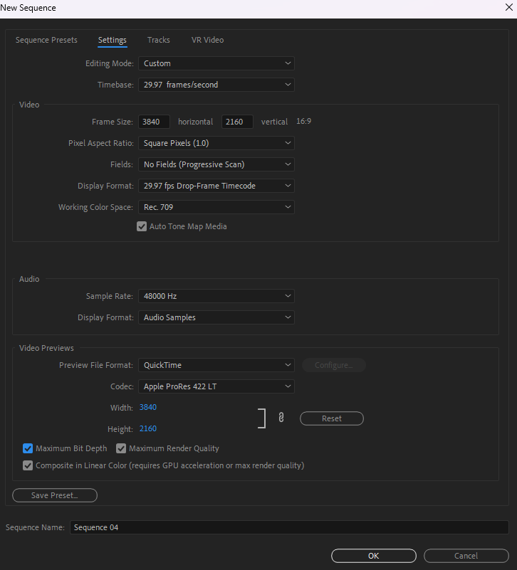

# DroneBasedDisasterMonitoring

## Team Information
- **Team Name:** ***W5***
- **Team Members:** 
    - [MADHAV BOHRA](https://github.com/MadhavBohra) (BITS ID: 2021A2PS2155P, Mail: [f20212155@pilani.bits-pilani.ac.in](mailto:f20212155@pilani.bits-pilani.ac.in))
    - [VAL DIDAR SINGH](https://github.com/valdidar) (BITS ID: 2021A3PS2233P, Mail: [f20212233@pilani.bits-pilani.ac.in](mailto:f20212233@pilani.bits-pilani.ac.in))
    - [ARYAN KUMAR](https://github.com/Aryan-Kumar-25) (BITS ID: 2020A3PS0521P, Mail: [f20200521@pilani.bits-pilani.ac.in](mailto:f20200521@pilani.bits-pilani.ac.in))

## Project Overview
In this project, our team is working on building a deep learning model for Drone-Based Disaster Monitoring. The goal is to analyze real-world data captured by drones to improve disaster response and management. Milestone 1 is dedicated to data collection, where we have successfully gathered a dataset of 600 images to kickstart our project.


## Milestone #1
### Chosen Topic
Our team has chosen the following topic for data collection:
- *City Wildfires*

### Data Collection Details

#### Image Sources

We collected images from the following YouTube video sources:

* [Amazon Fires](https://youtu.be/5giZRtzMyaM?feature=shared)
* [Amazon Fires](https://youtu.be/HJ_8TH9qNpQ?feature=shared)
* [Amazon Fires](https://youtu.be/U-GcemDomYQ?feature=shared)
* [Greece Wildfires](https://youtu.be/BbREg6ojGm8?feature=shared)
* [Greece Wildfires](https://youtu.be/Otsjgn-NSzo?feature=shared)
* [Greece Wildfires](https://youtu.be/ISUGTjJidPQ?feature=shared)
* [Fort McMurray Wildfire](https://youtu.be/dVNmFyuMkQE?feature=shared)
* [Fort McMurray Wildfire](https://youtu.be/oxTxy0Okdfs?feature=shared)


These videos were chosen to provide diverse and representative visuals of wildfire incidents for our dataset.


#### Preprocessing

For our dataset, we went through a thorough preprocessing phase to ensure that the collected images were of the highest quality and that they accurately represented the aftermath of wildfires. Our preprocessing steps included:

1. **Video Selection and Trimming**: After collecting images from multiple YouTube videos, we carefully selected portions of the videos where the aftermath of wildfires was clearly visible. We trimmed out sections where the relevant visual data was not present to focus solely on the disaster's impact.

2. **Logo Removal**: To ensure that our dataset is free from any distracting elements, we also cropped out sections of the video frames where logos or unnecessary visual elements were present. This step helped maintain the focus on the wildfire aftermath without any visual distractions.

3. **Video Rendering in 4K**: To enhance the image quality and resolution, we utilized Adobe Premiere Pro for video editing. The trimmed segments, now free from logos and distractions, were rendered in 4K resolution, significantly improving the visual clarity and detail of the images.

4. **Video Compilation**: After rendering individual segments in 4K, we compiled them into a single video. This allowed us to create a continuous and comprehensive visual representation of the aftermath of wildfires, facilitating the extraction of frames for our dataset.

The use of Adobe Premiere Pro ensured that our dataset contains high-quality images that accurately depict the post-wildfire scenarios. This preprocessing step, which included logo removal, was vital in maintaining the integrity and relevance of our dataset for deep learning model training.

***The Output Rendering Settings are as follows:***


As the video was large to be uploaded on Google Drive, We uploaded the final video on Youtube as unlisted, [link](https://youtu.be/hCNhARWnXKY)


#### Frame Extraction Process:

In the frame extraction phase, we employed a Python script to evenly extract 600 frames from our preprocessed 4K video, ensuring representation across various phases of the wildfire aftermath. Each frame was resized to 256x256 pixels for consistency, and we applied the naming conventions as specified in the shared milestone documentation for easy dataset management.

#### Running the Python File

1. **Environment Setup:**

```shell

pip install virtualenv
virtualenv env
source env/Scripts/activate
pip install -r requirements.txt
```

2. **Video Source:** Download the Youtube video, whose link is given above and paste it in the `Input` folder

3. **Run the Script:**

```shell
python VideoToFrames.py
```

## Submission Milestone #1
Our team has compiled and consolidated our dataset of 600 images, each resized to 256x256 pixels, and stored them in `Output/Images`. Each image is logically named using our team's number as a prefix.
